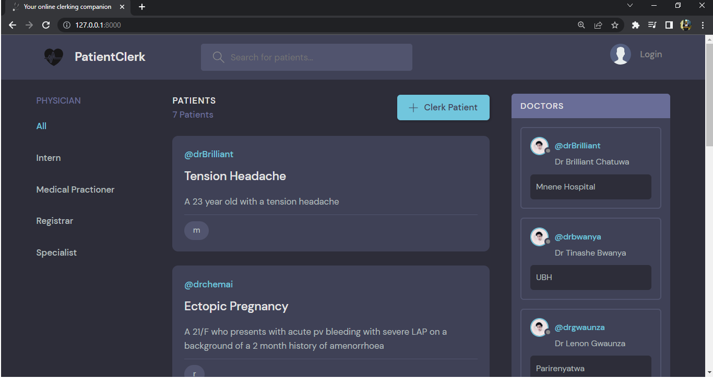

# PatientClerk
Patient Clerk is a django web application that helps doctors take and manage clinical patients' history and examination in a clean, intuitive and easy to follow interface.

## Project Decription
This is a web application built using the Django web framework version 4.2.2. The whole application has been built in a django environment including the frontend which is mainly comprised of Django's template system.

## Inspiration
This project is a personal project of mine but that's come out of frustration that I have faced in my other workplace as  a medical doctor. Currently in Zimbabwe we are still by and large using pen and paper to record patient medical history. This may be functional but in the 21st century is highly inefficient. 

It hampers long term follow up of patients especially patients with chronic illnesses like diabetes and hypertension in that, those papers we use for history taking usually get lost. Issues with sharing patient medical history between healthcare professionals is also hampered due to handwriting legibility.

While there are software solutions beginning to come up like the government backed Impilo system, this is slow and still does not cater for the private sector. I have developed patientclerk as a simple web interface targetting the doctor in their private practice seeing clinic/outpatient patients to be able to record patient history seamlessly and be able to access that data on demand. The app has been created with room to grow to become even more complex logically and offer more features to the doctor. It is my hope this app will eventually get used by doctors in my country and beyond.

## Installation
- This installation is for an ubuntu machine
- Make sure you have Python3 installed
- Then install pip3 if not already installed together with some dependencies
```
sudo apt update
sudo apt install python3-pip python3-dev build-essential libssl-dev libffi-dev python3-setuptools
```
- Install mysql server ```sudo apt install mysql-server```
- Run ```sudo systemctl start mysql.service```
- Have root access mysql with a password of your choice
- The install mysql client with:
```
sudo apt-get install libmysqlclient-dev
sudo apt-get install zlib1g-dev
sudo pip3 install mysqlclient
```
- Clone this repository unto your machine and ```cd``` into it
- Open mysql interactive prompt and run ```source setup_mysql_django.sql``` to create a mysql user, database for django 
- Install venv, for creating a virtual environment
```
sudo apt install python3-venv
python3 -m venv virtual
```
- Your virtual environment is named virtual
- Run ```source virtual/bin/activate``` to activate the virtual environment
- Open up ```settings.py``` and adjust a few settings
1. Adjust the variable ALLOWED_HOSTS to be equal your domain name or server IP address
2. Create a new file secret_key.txt and place a secret key in there - it can be any large random number, eg 50 characters long
3. Adjust the variable SECRET_KEY and replace the dummy file name written there with the name of your newly created file
- Close the settings file
- Install django and gunicorn ```pip install django gunicorn```
- Next run the following to populate the mysql database with data
```
python manage.py migrate 
python manage.py createsuperuser (You will be prompted for username, password etc, enter what you like)
python manage.py collectstatic
```
- Deactivate the virtual environment by ```deactivate```
- Next create a systemd file to create a gunicorn socket
- The socket will connect nginx web server to the django app
- Run ```sudo vi /etc/systemd/system/gunicorn.socket``` and enter the following
```
[Unit]
Description=gunicorn socket

[Socket]
ListenStream=/run/gunicorn.sock

[Install]
WantedBy=sockets.target
```
- Now create a service file for gunicorn as a systemd file, Systemd files enable the app to be automatically run everytime
- Run ```sudo vi /etc/systemd/system/gunicorn.service``` and enter the following
```
[Unit]
Description=gunicorn daemon
After=network.target

[Service]
User=username  (replace username with your linux username)
Group=www-data
WorkingDirectory=path_where_manage.py_is_on_your_machine
ExecStart=path_where_manage.py_is/virtual/bin/gunicorn \
	--access-logfile - \
	--workers 3 \
	--bind unix:/run/gunicorn.sock \
	portfolio.wsgi:application

[Install]
WantedBy=multi-user.target
```
Now run the following to start the gunicorn systemd file
```
sudo systemctl start gunicorn.socket
sudo systemctl enable gunicorn.socket
sudo systemctl daemon-reload
sudo systemctl restart gunicorn
```
- Now install Nginx by ```sudo apt-get install nginx```
- Create a server block for the new django app by running ```sudo vi /etc/nginx/sites-available/patientclerk```
- Now enter the following into that file
```
server {
    listen 80;
    server_name 45.76.42.234;

    location = /favicon.ico { access_log off; log_not_found off; }

    location / {
        include proxy_params;
        proxy_pass http://unix:/run/gunicorn.sock;
    }

    location  /static/ {
        root full_path_of_django_project_where_manage.py_is_on_your_machine;
    }

    location  /media/ {
        root full_path_of_django_project_where_manage.py_is_on_your_machine;
    }
}
```
- Run ```sudo nginx -t``` to check for sytax errors
- If none run ```sudo systemctl restart nginx```
- Install a free SSL if your domain provider doesn't provide one
- ```sudo apt-get install python3-certbot-nginx```
- ```sudo certbot --nginx -d yourdomain -d www.yourdomain```
- Go to your domain and it should be up in https rather than http
## Progress
This is still an ongoing project.
Currently it's set up that both the backend and frontend have been developed using django - Django templates for the frontend
The frontend will be migrated to React eventually and have that connect to the Django backend using API developed with the DJANGO REST API framework
There are still some unit tests to be pushed

## Screenshots of the web app


## Credit
Some themes on the frontend were used from [Github](https://github.com/divanov11/StudyBud). These gave a base upon which customization was then done

## AUTHORS
Brilliant Chatuwa [Github](https://github.com/brilliantchats)

## LICENCE
Public Domain. Permission from author needed for commercial use.
